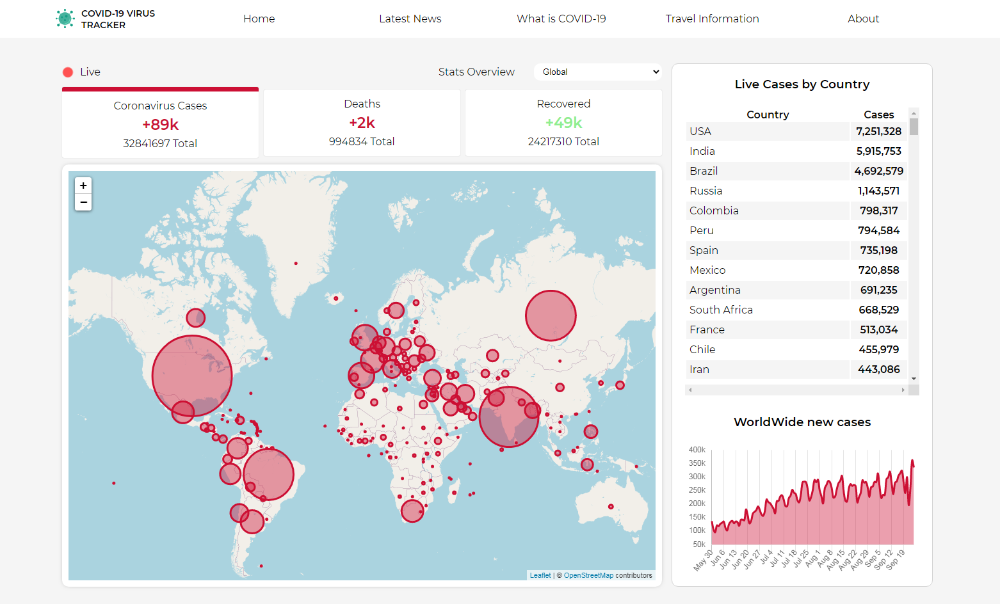

# COVID-19 virus tracker

 

  

## :pencil: Description

COVID-19 virus tracker is non-commercial project created for fun as a part of learning new technologies.  
 
The project was largely inspired by the site [coronatracker.com](https://www.coronatracker.com/) where all the contents are handpicked, filtered, and curated by volunteers to our best extent and ensure that sources are reliable with minimal hoaxes and fake news, in the best benefit of the public.  
 
APIs that I used making this website:
 

- **[api.coronatracker.com](http://api.coronatracker.com/)**
- **[disease.sh](https://disease.sh/)**

## :wrench: Tools

**The following tools were used in project:**

- **React**
- **Hooks**
- **Leaflet**
- **Chart.js**
- **Styled-Components**
- **Moment.js**
- **Numeral.js**
- **Firebase-hosting**

## :construction_worker: Install

### `npm install`

Installs the necessary application dependencies

## Available Scripts

In the project directory, you can run:

### `npm start`

Runs the app in the development mode. 
Open [http://localhost:3000](http://localhost:3000) to view it in the browser.

### `npm run test`

Launches the test runner in the interactive watch mode.

## :clap: Credits

[coronatracker.com](https://www.coronatracker.com/)
 
[api.coronatracker.com](http://api.coronatracker.com/)
 
[disease.sh](https://disease.sh/)

## :movie_camera: Live

https://covid-19-virus-tracker.web.app/
